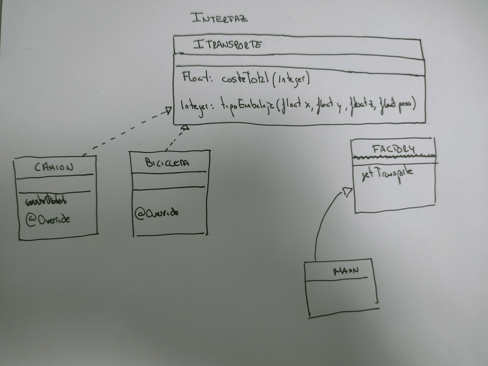

# FACTORY

En este proyecto ponemos en práctica el modelo factory.

Tenemos un paquete llamado:

     com.ayesa

En el cual hay varias clases:
    
    Bicicleta
    Camion
    Factory

Y una interfaz:

    ITransporte

Tras tener estas clases, hacemos el siguiente esquema:

Aquí el [JavaDoc]()